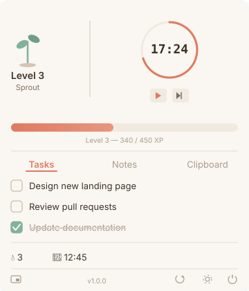
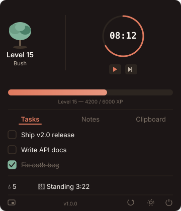
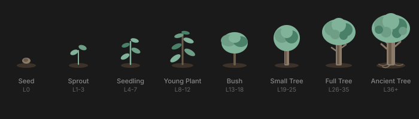
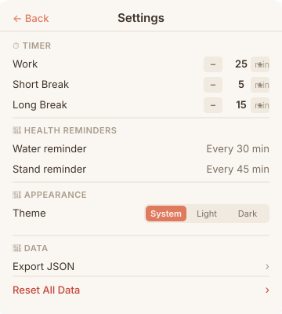

<p align="center">
  
</p>

<h1 align="center">Niwa (庭)</h1>

<p align="center">
  <strong>Grow your productivity, one session at a time.</strong>
</p>

<p align="center">
  A native macOS menu bar app that combines a focus timer, task management, quick notes, and health reminders — all wrapped in a gamified leveling system where your virtual plant grows as you do.
</p>

<p align="center">
  
  
  
  
  
</p>

<br />

<p align="center">
  
  &nbsp;&nbsp;&nbsp;&nbsp;
  
</p>

<p align="center">
  <sub>Light mode (warm cream) &nbsp;&nbsp;·&nbsp;&nbsp; Dark mode (warm brown)</sub>
</p>

---

<details>
<summary><strong>Table of Contents</strong></summary>

- [Features](#-features)
- [Plant Growth](#-plant-growth)
- [Install](#-install)
- [How It Works](#-how-it-works)
- [Settings](#%EF%B8%8F-settings)
- [Design System](#-design-system)
- [Architecture](#-architecture)
- [Privacy](#-privacy)
- [Contributing](#-contributing)
- [Changelog](#-changelog)
- [License](#-license)

</details>

---

## Features

### Focus Timer
- Simple commit-or-cancel focus sessions (no forced breaks or rounds)
- Preset duration chips (default: 15 / 25 / 45 min) — customizable in settings
- Custom duration stepper (1–120 min)
- Date-based time tracking (no drift on sleep/wake)
- Circular progress ring with SF Mono countdown
- Daily focus streak dots
- **+1 XP per minute** on session completion (e.g. 25 min = +25 XP)

### Task Management
- Quick-add with Enter to submit
- Tap to complete with strikethrough animation
- Drag-to-reorder with persistent sort order
- Clear completed tasks in one action
- **+15 XP** per task completed

### Quick Notes
- Instant note creation from the dropdown
- Full text editor with word count
- Auto-save on navigation and close
- Sorted by last updated
- **+5 XP** per note created

### Health Reminders
- Water and standing reminders on configurable intervals
- Smart scheduling: respects work hours and lunch breaks
- Automatically pauses during lunch and outside work hours
- Actionable macOS notifications with Done / Snooze (10 min)
- Live standing timer with elapsed time and milestone badges
- Coffee tracking with penalty system (**+10 XP** per coffee, **-5 XP** after 3 per day)
- Creatine and gym tracking (once daily, with undo)
- **+10 XP** per water/stand/coffee, **+15 XP** creatine, **+30 XP** gym
- Standing XP milestones: bonus XP at 10/20/30 min
- All daily habits reset at 7am (not midnight)

#### How Reminders Work

```
┌─ Settings ──────────────────────────────────────────────┐
│  Water every: 30 min  │  Stand every: 45 min            │
│  Work hours: 9 AM – 5 PM  │  Lunch: 12 – 1 PM          │
└─────────────────────────────────────────────────────────┘
        │
        ▼
┌─ Smart Scheduling ──────────────────────────────────────┐
│  • Before work hours → schedules at work start          │
│  • During work → fires at your set interval             │
│  • During lunch → reschedules to after lunch ends        │
│  • After work hours → schedules for tomorrow morning     │
│  • Snoozed → delays by 10 minutes (lunch-aware)         │
└─────────────────────────────────────────────────────────┘
        │
        ▼
┌─ macOS Notification ────────────────────────────────────┐
│  🔔 Niwa                                                │
│  Time for Water / Time to Stand                         │
│  [ Done / Stand Up ]  [ Snooze 10 min ]                 │
└─────────────────────────────────────────────────────────┘
        │
        ▼
┌─ In-App Tracking ───────────────────────────────────────┐
│  💧 3 waters today (+10 XP each)                        │
│  🧍 Standing 2:34 (+10 XP when you sit down)            │
│  → All activity feeds into the XP chart & leveling      │
└─────────────────────────────────────────────────────────┘
```

### XP & Leveling
- Earn XP from every productive action
- Level formula: Total XP to reach Level N = 25N² + 75N
- Level-up overlay with confetti animation (respects Reduce Motion)
- 7-day XP chart with daily breakdowns
- Menu bar icon evolves with your level

### Floating Window
- Compact, borderless mini window
- Shows timer + current task
- Draggable, remembers position
- Optional always-on-top mode
- Non-activating — never steals focus

### Dark Mode
- Full light/dark theme support
- Warm cream (#FAF6F1) light / warm brown (#1C1917) dark
- System, Light, or Dark override in settings
- All colors adapt automatically via asset catalog

---

## Plant Growth

Your virtual plant grows as you level up — a visual representation of your productivity journey.

<p align="center">
  
</p>

| Stage | Levels | Description |
|-------|--------|-------------|
| **Seed** | 0 | A small seed resting in soil |
| **Sprout** | 1–3 | First green shoot breaks through |
| **Seedling** | 4–7 | Small stem with a few leaves |
| **Young Plant** | 8–12 | Growing taller with branching leaves |
| **Bush** | 13–18 | Full leafy bush |
| **Small Tree** | 19–25 | Trunk forms, canopy develops |
| **Full Tree** | 26–35 | Mature tree with full canopy |
| **Ancient Tree** | 36+ | Majestic tree with deep roots |

---

## Install

### Homebrew (recommended)

```bash
brew install --cask saidjamesphilip/tap/niwa
```

To update: `brew upgrade niwa`

> **Upgrade error?** If you see "App source not there", run:
> ```bash
> brew uninstall --cask --force niwa && brew install --cask saidjamesphilip/tap/niwa
> ```

### Quick Install via Terminal

```bash
curl -sL https://niwa-app.pages.dev/install.sh | bash
```

### Manual Download

1. Download the latest `.zip` from [Releases](https://github.com/saidjamesphilip/Niwa/releases/latest)
2. Unzip and drag `Niwa.app` to your **Applications** folder
3. Right-click the app → **Open** (first launch only, to bypass Gatekeeper)

### Build from Source

> **Requirements:** Xcode 16+, macOS 15.0+, [XcodeGen](https://github.com/yonaskolb/XcodeGen)

```bash
git clone https://github.com/saidjamesphilip/Niwa.git
cd Niwa
xcodegen generate
open Niwa.xcodeproj
```

Then press **Cmd+R** in Xcode to build and run.

<details>
<summary><strong>Install XcodeGen (if needed)</strong></summary>

```bash
brew install xcodegen
```

</details>

<details>
<summary><strong>Troubleshooting: "App is damaged" error</strong></summary>

If macOS shows a warning when opening, remove the quarantine flag:

```bash
xattr -cr /path/to/Niwa.app
```

</details>

### Updating

Niwa has a built-in update checker — open **Settings → About → Check for updates**. It compares your version against the latest GitHub Release and links you to the download if a newer version is available.

---

## How It Works

Niwa lives in your menu bar as a small leaf icon. Click it to open the dropdown panel.

### Menu Bar Icon Evolution

| Level Range | Icon | Description |
|-------------|------|-------------|
| 0–5 | `leaf.circle` | Starting out |
| 6–15 | `leaf` | Growing |
| 16–30 | `leaf.fill` | Flourishing |
| 31+ | `tree` | Fully grown |

### Dropdown Layout

```
┌─────────────────────────────┐
│  🌱 Plant  │  ⏱ Timer      │  ← Hero section
│  Seed      │  24:38         │
│────────────┴────────────────│
│  ████████████░░░  72% XP    │  ← XP progress bar
│─────────────────────────────│
│  Tasks │ Notes              │  ← Content tabs
│─────────────────────────────│
│  ☐ Design new landing page  │
│  ☑ Review pull requests     │
│  ☐ Update documentation     │
│─────────────────────────────│
│  💧 3  🧍 12:45 standing    │  ← Health status
│─────────────────────────────│
│  ▁▃▅▇▅▃▁  7-day XP chart   │  ← Activity
│─────────────────────────────│
│  🪟  vX.Y.Z    🔄  ⚙️  ⏻   │  ← Toolbar
└─────────────────────────────┘
```

### Data Storage

All data is stored locally using **SwiftData** with an App Group container. Nothing is sent to any server.

| Data | Storage |
|------|---------|
| Tasks, notes | SwiftData (SQLite) |
| Timer sessions | SwiftData with Date-based tracking |
| XP events | SwiftData with source attribution |
| User preferences | SwiftData (UserProfile model) |
| Window position | UserDefaults |

---

## Settings

<p align="center">
  
</p>

Settings are embedded inline in the dropdown — no separate window.

| Section | Options |
|---------|---------|
| **⏱️ Focus Timer** | Quick Pick Presets (editable list, 1–5 presets, 1–120 min each) |
| **💚 Health** | Water interval, standing interval, reminders on/off |
| **💼 Work Hours** | Start/end time (reminders only fire within) |
| **🍜 Lunch** | Start/end time (reminders paused during) |
| **🎨 Appearance** | System / Light / Dark theme |
| **💾 Data** | Reset All Data |

> [!TIP]
> **Reset All Data** wipes everything — tasks, notes, XP, settings — and returns you to Level 0 with a fresh seed.

---

## Design System

Niwa uses a custom warm, earthy design language inspired by Japanese gardens.

### Color Palette

| Token | Light | Dark | Usage |
|-------|-------|------|-------|
| `background` | `#FAF6F1` | `#1C1917` | Main panel background |
| `backgroundSecondary` | `#F0EAE0` | `#2C2520` | Cards, sections |
| `primary` | `#E07A5F` | `#E07A5F` | Terracotta — buttons, accents |
| `secondary` | `#81B29A` | `#81B29A` | Sage green — health, success |
| `textPrimary` | `#3D3229` | `#FAF6F1` | Headings, body text |
| `textSecondary` | `#7A6E63` | `#BFB3A5` | Supporting text |
| `textMuted` | `#A89B8C` | `#7A6E63` | Timestamps, hints |
| `danger` | `#C44536` | `#E05545` | Destructive actions |

### Typography

| Style | Spec |
|-------|------|
| Title | System Rounded, 18pt semibold |
| Heading | System Rounded, 15pt medium |
| Body | System, 13pt regular |
| Caption | System, 11pt regular |
| Mono | SF Mono, 12pt regular |
| Timer | SF Mono, 28pt medium |

---

## Architecture

```
Niwa/
├── project.yml                  # XcodeGen project definition
├── NiwaApp/                     # Main app target
│   ├── NiwaApp.swift            # @main entry, MenuBarExtra
│   ├── AppDelegate.swift        # Lifecycle, notification delegate
│   ├── Services/                # Business logic
│   │   ├── TaskManager.swift
│   │   ├── NoteManager.swift
│   │   ├── AppErrorState.swift
│   │   ├── HealthEventManager.swift
│   │   ├── UserProfileManager.swift
│   │   ├── NotificationManager.swift
│   │   ├── ReminderTimerManager.swift
│   │   ├── SoundManager.swift
│   │   └── UpdateChecker.swift
│   ├── Views/                   # SwiftUI views
│   │   ├── DropdownRootView.swift
│   │   ├── Components/
│   │   │   ├── HeroView.swift       # Plant + timer + XP bar
│   │   │   ├── PlantView.swift      # 8 growth stages (pure SwiftUI)
│   │   │   ├── LevelUpOverlay.swift
│   │   │   └── ...
│   │   └── Settings/
│   │       └── InlineSettingsView.swift
│   └── Assets.xcassets/         # Color sets (light + dark)
├── NiwaShared/                  # Shared between app + widget
│   ├── Constants/
│   │   ├── DesignTokens.swift   # Colors, spacing, typography
│   │   └── XPConstants.swift    # XP amounts, level formula
│   ├── Engines/
│   │   ├── GamificationEngine.swift
│   │   └── FocusTimerEngine.swift
│   └── Models/                  # SwiftData @Model entities
│       ├── UserProfile.swift
│       ├── NiwaTask.swift
│       ├── NiwaNote.swift
│       ├── TimerSession.swift
│       ├── HealthEvent.swift
│       └── XPEvent.swift
└── NiwaWidget/                  # WidgetKit extension
    ├── SmallWidgetView.swift
    ├── MediumWidgetView.swift
    └── LargeWidgetView.swift
```

### Key Design Decisions

| Decision | Rationale |
|----------|-----------|
| **MenuBarExtra (.window)** | Native macOS menu bar dropdown, no Dock icon |
| **SwiftData** | Modern persistence with @Query reactivity |
| **Date-based focus timer** | No drift on sleep/wake — compares against wall clock |
| **Shared ModelContainer** | Single context across all managers prevents stale state |
| **NSPanel floating window** | Non-activating, doesn't steal focus from other apps |
| **XcodeGen** | Reproducible project file, clean diffs |
| **Pure SwiftUI plant shapes** | No image assets needed, scales to any size |

---

## Privacy

| | Detail |
|-|--------|
| **Data storage** | All data stored locally in SwiftData (App Group container) |
| **Network** | No analytics, no telemetry, no tracking. Optional manual "Check for Updates" calls GitHub Releases API |
| **Clipboard** | Not accessed — Niwa does not read your clipboard |
| **Notifications** | Local `UNUserNotificationCenter` only. No push servers |

> [!IMPORTANT]
> Niwa never sends your data anywhere. Everything lives on your Mac. The only network call is a manual "Check for Updates" in Settings.

---

## Contributing

Contributions are welcome! See [CONTRIBUTING.md](CONTRIBUTING.md) for development setup, code style, and pull request guidelines.

Found a security issue? Please report it privately — see [SECURITY.md](SECURITY.md).

This project follows the [Contributor Covenant](CODE_OF_CONDUCT.md) code of conduct.

---

## Changelog

See [CHANGELOG.md](CHANGELOG.md) for version history.

---

## License

MIT License — see [LICENSE](LICENSE) for details.

---

<p align="center">
  <strong>Niwa (庭)</strong> — Japanese for "garden"
  <br />
  <em>Tend your garden. Grow your focus.</em>
</p>
